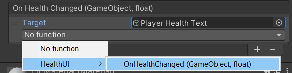
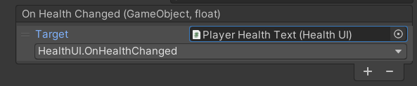

# Serialized-Events
Allows for event callbacks to be serialized in the editor. There are the `SerializedAction` and `SerializedFunc`. These supports callbacks with zero to many parameters and a return value (for `SerializedFunc`). Unlike Unity's `UnityEvent`, you can only serialize methods that match the parameters and return type.

# Example

Create a class with a serialized event.

```csharp
public class Player : MonoBehaviour
{
    [SerializeField]
    private float currHealth = 100f;

    public float Health
    {
        get => currHealth;
        private set
        {
            // Here we fire our event
            onHealthChanged.Invoke(currHealth, value);
            currHealth = value;
        }
    }

    // The serialized event!
    [SerializeField]
    private SerializedAction<float, float> onHealthChanged;

    private void Start()
    {
        // Adding a listener at runtime
        onHealthChanged.AddListener(OnHealthChanged);
    }

    private void Update()
    {
        if (Input.GetKeyDown(KeyCode.Space))
        {
            TakeDamage(10);
        }
    }

    public void TakeDamage(float amount)
    {
        Health -= amount;
    }

    private void OnHealthChanged(float oldVal, float newVal)
    {
        if (newVal <= 0)
        {
            Debug.Log("Player died.");
            Destroy(gameObject);
        }
    }
}
```

Then create a class with a public method matching the type parameters.

```csharp
public class HealthUI : MonoBehaviour
{
    [SerializeField]
    private Text text;

    // Must be public
    public void OnHealthChanged(float oldVal, float newVal)
    {
        text.text = newVal.ToString();
    }
}
```

Assign the method in the inspector.






# Creating your own SerializedEvents

You can also subclass any of the serialized events: SerializedAction, SerializedFunc, or the SerializedEventBase.

You can subclass the SerializedEventBase and using a custom delegate type, or simply subclass any of the SerializedAction or SerializedFunc classes.

```csharp
// The Serializable attribute is needed for the event to show up in the inspector.
[System.Serializable]
public class CharacterDied : SerializedAction<GameObject>
{
}
```

If you want the method paramters to have names, you can create your custom delegate.

```csharp
// Custom delegate
public delegate void CharacterDamaged(GameObject character, float amount);

// Use the CharacterDamaged delegate as the type parameter for SerializedEventBase<T>.
[System.Serializable]
public class CharacterDamagedEvent : SerializedEventBase<CharacterDamaged>
{
    // Create an Invoke method matching the delegate.
    public void Invoke(GameObject character, float amount)
    {
        // then invoke each callback in this.
        foreach (var callback in this)
        {
            callback.Invoke(character, amount);
        }
    }
}
```

If you need more than four parameters, you can extend the SerializedEventBase class.

```csharp
[System.Serializable]
public class SerializedFunc<T1, T2, T3, T4, T5, TResult> : SerializedEventBase<System.Func<T1, T2, T3, T4, T5, TResult>>
{
    // Create an Invoke method matching the delegate.
    public TResult Invoke(T1 arg1, T2 arg2, T3 arg3, T4 arg4, T5 arg5)
    {
        // then invoke each callback in this.
        foreach (var callback in this)
        {
            callback.Invoke(arg1, arg2, arg3, arg4, arg5);
        }
    }
}
```
